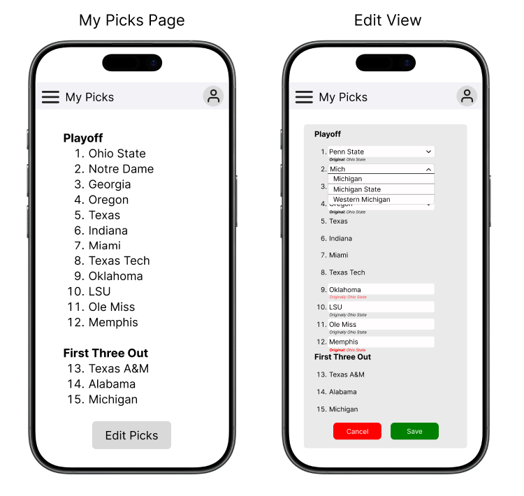
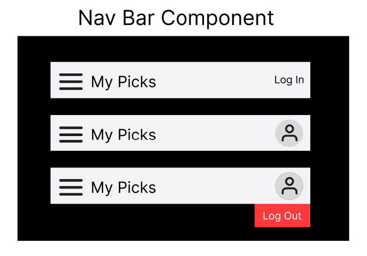

# Design: CFP Pool Tracker

## Overview

### Problem Statement

Tyler has to manually request, collect, validate, and track updates to participants' submissions in the CFP Pool. He's got better ways to spend that time.  

### Goal

Automate the submission and validation of participants' updates to their CFP Pool picks and give Tyler the ability to view these picks. 

### Target Users

- Active Participants in the 2026-27 CFP Pool.
- Admin of the pool (Tyler). 

### Scope

This document covers features desired before the October 11 deadline, which is when week 6 of the season ends. For out-of-scope features, see the [roadmap](./roadmap.md).

## Requirements

### In Scope

- User can view their submitted CFP Playoff picks.
- User can update their picks according to the rules and choose a champion between midnight ET going into October 11 and 7pm ET on October 13.
- User cannot submit their picks unless they adhere to all [rules](../rules.md).
  - Mistakes are identified to the user so they can correct them.
  - Their existing picks remain set until they have submitted valid picks.
- Only users with submitted picks can sign into the site to view their picks.
- User can view a home page which introduces the game, explains its rules, and tells the user where to get help should they need it.
- The site is hosted somewhere that allows all users to access it.
- The site is mobile-friendly (users will likely be accessing the site via mobile device).

### Out of Scope

*I took the three highest-priority from the [roadmap](./roadmap.md) as "on-deck" features. We can replace these if other items from the roadmap are higher priority.*

- User can see all other users' picks.
- Admin-level user can modify any user's picks at any time.
- User can view a live leaderboard tallying each submission's points.

## Core Features

### Home Page

#### User Story

As a user, I would like to know more about the site I just landed on.

#### Changes Necessary

- Create a new page.
- Add a "Welcome" section to the page, explaining the purpose of the application.
- Add a "Viewing and Modifying Picks" section to the page, explaining how to log in, view picks, and when picks can be modified.
- Add a "Questions?" section to the page, telling users to ask Tyler for help. Tell them to buzz off if they don't know who Tyler is (clearly they're in the wrong place).

### Login Component

#### User Story

As a user, I want to log into the site to view and manage my picks.

#### Changes Necessary

- Create a component which blocks access to "My Picks" page.
- Add a form requesting a user's email address.
  - Actions:
    - If the email address is valid, send a One-Time Password (OTP) to the email on file.
    - If it is not, tell the user their email address does not have an associated submission.
- Add a form requesting an OTP from the user.
  - Actions:
    - If the password is correct, send the user to the "My Picks" page.
    - If the password is incorrect, offer them "Send a New Code" and "Cancel" buttons
  - Notes:
    - Only show this once the password has been sent to the user's email address.
    - Refreshing the page should send the user back to the start of login process.

### "My Picks" Page

#### User Story

As a user, I would like to view and modify my submitted picks for the current season.

#### Changes Necessary

- Create a new page
- Display current picks with subtitles 
  - "Playoff": 1-12
  - "First Three Out": 13-15
- Add an edit button in top right
  - Disabled outside of specified time range 
  - On click, open edit view
- Add edit view:
  - Show similar numbered list, but each team is now an editable text box
    - Nice-to-have: text box shows dropdown beneath which auto-populates from team list while typing
    - Nice-to-have: indication of what team was in that box before
  - Maybe we offer a side-by-side view for before and after? Could be tough on mobile
  - Has "save" and "cancel" buttons at bottom
    - Nice-to-have: An "Are you sure?" on cancel
  - When edit is saved, picks are updated on the backend via POST request and updated picks are shown on "My Picks" page
- Set up validation:
  - When "Save" is hit in the edit view, validate new picks against the rules.
  - If picks violate rules, compile a list of the violations and show them in the edit view. 
    - Leave picks as they were for user to edit
    - DO NOT save the picks to the backend

#### Wireframe

### Rules Page

#### User Story

As a user, I would like to know what the rules of the game are.

#### Changes Necessary

- Create a new page.
- Add static text explaining the rules. 
  - This should be agnostic of year (use weeks of season rather than dates).

### Navigation Bar

#### User Story

As a user, I want to navigate between pages available to me.

#### Changes Necessary

- Create navigation bar component.
- Add the component to all pages.
- Link to all existing pages.
- If a user is logged in, show a "Log Out" button in the top right corner with an "Are You Sure?" confirmation dropdown.
- Add hamburger menu with side panel for mobile navigation

#### Wireframe

## Architecture and Data Flow

### System Overview

### Frontend

### Backend / APIs

### Data Storage

- Users:submissions are a one:many relationship, so we need to include the year on a submission to ensure only the current year's submissions are shown. This will be the year the picks were submitted (e.g., 2026 for 26-27 season).

### Authentication

- Support OTP via email. Some hosting options (AWS) support an outbound mail server, or hosting options that don't (Vercel, Heroku) can use free-tier APIs to send emails. Options include:
  - Resend: Provides a developer-friendly API and a generous free tier for sending transactional emails.
  - SendGrid: Offers a free tier of 100 emails per day.
  - Mailgun / Postmark: Provide alternative APIs with robust deliverability and free or trial segments.

### Hosting

## Milestones and Tasks

## Open Questions