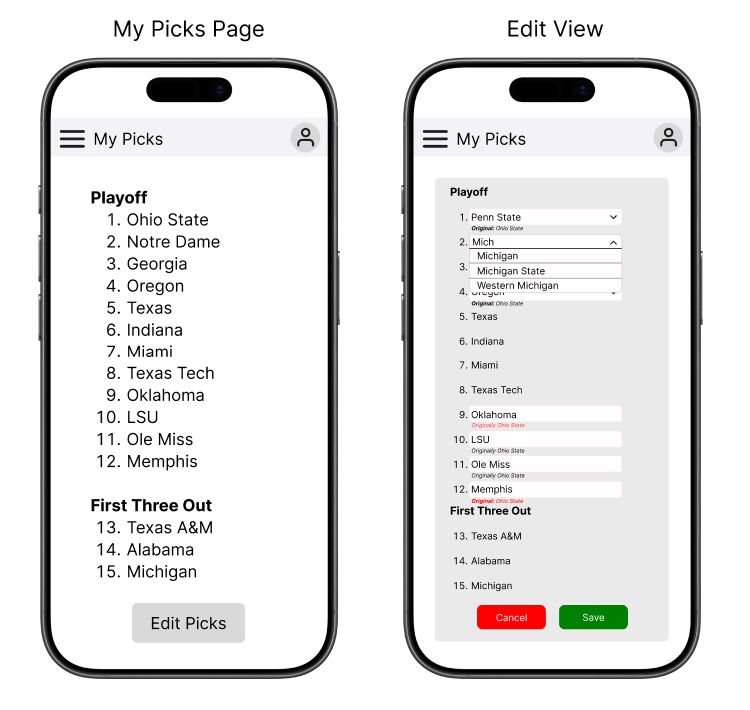
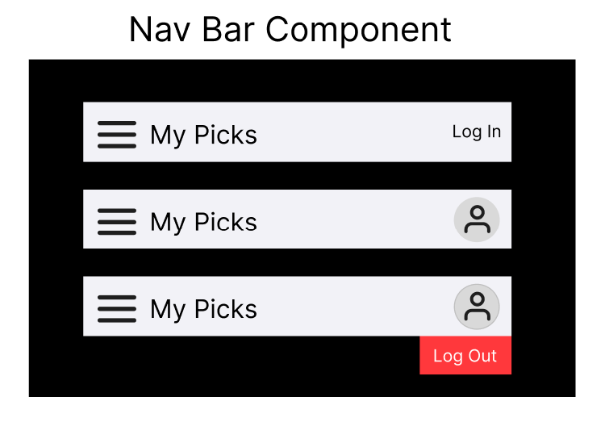

# Design: CFP Pool Tracker

## Overview

### Problem Statement

Tyler has to manually request, collect, validate, and track updates to participants' submissions in the CFP Pool. He's got better ways to spend that time.  

### Goal

Automate the submission and validation of participants' updates to their CFP Pool picks and give Tyler the ability to view these picks. 

### Target Users

- Active Participants in the 2026-27 CFP Pool.
- Admin of the pool (Tyler). 

### Scope

This document covers features desired before the October 17 at noon ET deadline, which is when week 6 of the season ends. For out-of-scope features, see the [roadmap](./roadmap.md).

## Requirements

### In Scope

- User can view their submitted CFP Playoff picks.
- User can update their picks according to the rules and choose a champion between midnight ET going into October 11 and 12pm on October 17.
- User cannot submit their picks unless they adhere to all [rules](./rules.md) and the [Validation Rules](#validation-rules) below.
  - Mistakes are identified to the user so they can correct them.
  - Their existing picks remain set until they have submitted valid picks.
  - A valid update must include a champion.
- Only users with submitted picks can sign into the site to view their picks.
- User can view a home page which introduces the game, explains its rules, and tells the user where to get help should they need it.
- The site is hosted somewhere that allows all users to access it.
- The site is mobile-friendly (users will likely be accessing the site via mobile device).

### Out of Scope

*I took the three highest-priority from the [roadmap](./roadmap.md) as "on-deck" features. We can replace these if other items from the roadmap are higher priority.*

- User can see all other users' picks.
- User can view a live leaderboard tallying each submission's points.
- Stats page: View Ty's notes
- In-app admin page for Tyler to view all participants' picks (this season, Tyler uses a documented Supabase view instead; see [Decisions](#decisions-from-design-review)).

## Core Features

### Home Page

#### User Story

As a user, I would like to know more about the site I just landed on.

#### Changes Necessary

- Create a new page.
- Add a "Welcome" section to the page, explaining the purpose of the application.
- Add a "Viewing and Modifying Picks" section to the page, explaining how to log in, view picks, and when picks can be modified.
- Add a "Questions?" section to the page, telling users to ask Tyler for help. Tell them to buzz off if they don't know who Tyler is (clearly they're in the wrong place).

### Login Component

#### User Story

As a user, I want to log into the site to view and manage my picks.

#### Changes Necessary

- Create a `/login` page that hosts the login component. Logged-out users who open "My Picks" are redirected to `/login`; logged-in users who open `/login` are redirected to "My Picks".
- Add a form requesting a user's email address.
  - Actions:
    - Submit the email and always show the same generic message (e.g., "If that email is registered, a code is on its way") regardless of whether it's actually a registered participant — per [otp-authentication-plan.md](./otp-authentication-plan.md), the app must not reveal whether an email is registered.
- Add a form requesting an OTP from the user.
  - Actions:
    - If the code is correct, send the user to the "My Picks" page.
    - Show "Send a New Code" and "Cancel" buttons as soon as this form appears, so a user whose code never arrives (or who mistyped their email) isn't stuck. If the code is incorrect, also say so.
  - Notes:
    - Only show this once the code has been sent to the user's email address.
    - Refreshing the page should send the user back to the start of login process.
    - "Send a New Code" is disabled for 30 seconds after a code is requested, matching Supabase's per-email minimum interval. The server answers a too-soon request with the same generic success as any other, so the limit can't reveal whether an email is registered.

### "My Picks" Page

#### User Story

As a user, I would like to view and modify my submitted picks for the current season.

#### Changes Necessary

- Create a new page
- Display current picks with subtitles 
  - "Playoff": 1-12
  - "First Three Out (Tiebreakers)": 13-15
- Add an edit button in top right
  - Disabled outside of specified time range 
  - On click, open edit view
- Add edit view:
  - Show similar numbered list, but each team is now an editable text box
    - Nice-to-have: text box shows dropdown beneath which auto-populates from team list while typing
    - Nice-to-have: indication of what team was in that box before
  - Maybe we offer a side-by-side view for before and after? Could be tough on mobile
  - Has "save" and "cancel" buttons at bottom
    - Nice-to-have: An "Are you sure?" on cancel
  - When edit is saved, picks are updated on the backend via POST request and updated picks are shown on "My Picks" page
- Add a champion selector to the edit view (a choice among the 12 teams currently in the top 12). Required to save.
- Set up validation:
  - When "Save" is hit in the edit view, validate new picks against the [Validation Rules](#validation-rules). Validation lives only in the client (shared pure functions in e.g. `lib/validation.ts`).
  - If picks violate rules, compile a list of the violations and show them in the edit view. 
    - Leave picks as they were for user to edit
    - DO NOT save the picks to the backend
- When showing teams, could we indicate conference/show logo PNG?
- Add a popup to Edit View which shows all a user's changes when they click "Save"
  - Shows side-by-side view of picks, or maybe even just a list of the changes they made (e.g., "Oregon -> Oklahoma")
  - If they had too many changes, tell them what's wrong with each bad change (e.g., don't have a g5 team, too many teams, etc.)

#### Wireframe



### Validation Rules

This is the authoritative list of what makes an updated submission valid. It is enforced **client-side only** (see [Decisions](#decisions-from-design-review)); the server trusts the pick contents. All comparisons are against the user's `initial_playoff` / `initial_tiebreakers`, **never** against their previous save, so a user may save repeatedly during the window.

An update is valid only if all of these hold:

1. **Shape:** exactly 12 teams in the top 12 and exactly 3 in the First Three Out; every team exists in `teams`; no team appears twice anywhere across the 15.
2. **No overlap:** none of the First Three Out is in the top 12 (this is implied by "no duplicates", but give it its own error message).
3. **G6 requirement:** the top 12 includes at least one team with `is_power_conf = false` (Notre Dame counts as power-equivalent; UConn does not).
4. **Champion:** a champion is chosen, and that team is in the **top 12** of the updated picks.
5. **Move limit:** the update uses **at most 3 moves**, counted as below.

#### How moves are counted

Only the top 12 is counted. **Changes to the First Three Out never count as moves** (rule 2 is the only constraint on them). Choosing a champion does not count either.

Compare the new top 12 to `initial_playoff` slot by slot (slot = position 1-12):

- **Replacements:** each slot whose new team was *not* in the initial top 12 is **1 move**. A team promoted from the First Three Out is a replacement like any other.
- **Reorder:** after setting replaced slots aside, if any team that *was* in the initial top 12 and is still there now sits in a different slot than it initially did, that is **1 move in total**, no matter how many teams changed position or how far.

`moves = replacements + (reordered ? 1 : 0)`

Worked examples are in [example_valid_moves.md](./example_valid_moves.md). Notes for the implementer:

- A new team placed in a different slot than the team it replaced forces a retained team to shift, so that update counts as replacement + reorder (2 moves).
- Dropping a top-12 team and putting it in the First Three Out, then filling its slot with a new team, is 1 move (one replacement). The First Three Out edits are free.
- Write the move counter as a pure function `countMoves(initialTop12, newTop12): number` with unit tests covering every example in `example_valid_moves.md`.

### Rules Page

#### User Story

As a user, I would like to know what the rules of the game are.

#### Changes Necessary

- Create a new page.
- Add static text explaining the rules. 
  - This should be agnostic of year (use weeks of season rather than dates).

### Navigation Bar

#### User Story

As a user, I want to navigate between pages available to me.

#### Changes Necessary

- Create navigation bar component.
- Add the component to all pages.
- Link to all existing pages.
- If a user is logged out, show a "Log In" link in the top right corner. If they are logged in, show an avatar button there instead, which opens an "Are you sure?" dropdown with "Log Out" and "Cancel".
- Add hamburger menu with side panel for mobile navigation

#### Wireframe



## Architecture and Data Flow

### System Overview

### Frontend

- Next.js application with React

#### Pages

- Home
- Rules
- My Picks

#### Components

- Log In
- Nav Bar
- (Maybe) Edit Picks

### Backend / APIs

- No separate Express/REST server. The Next.js app's own server-side code — API routes (or server actions/Server Components, implementation detail TBD) — *is* the backend.
- **The browser never talks to Supabase directly.** All reads and writes to the database go through Next.js server-side code, which holds the Supabase credentials and uses Supabase's server-side client. The client only ever calls our own Next.js endpoints.
- Why this matters: it keeps one consistent trust boundary. The server-side code is also where we verify *who* is making a request (via the session — see [session-management-plan.md](./session-management-plan.md)) before doing anything on that user's behalf. We never accept a client-supplied user ID for a read or write — the user ID always comes from the verified session, server-side. This is the same rule the session plan already establishes; routing all DB access through the server is what makes it enforceable (a direct-from-browser Supabase call would have no reliable place to check "is this really user 123 asking?").
- Authentication/session mechanics (how a user proves who they are, how that's remembered across requests) are **not** re-specified here — see [otp-authentication-plan.md](./otp-authentication-plan.md) and [session-management-plan.md](./session-management-plan.md), which are the authoritative source for that.

#### Configuration

The app needs three environment variables (see [Decisions](#decisions-from-design-review)). None has a `NEXT_PUBLIC_` prefix, so none is bundled into browser code.

| Variable | Used by | Set in |
|---|---|---|
| `SUPABASE_URL` | Server-side Supabase client | Local `.env.local` and Vercel |
| `SUPABASE_PUBLISHABLE_KEY` | Server-side Supabase client, with the user's session (RLS applies) | Local `.env.local` and Vercel |
| `SUPABASE_SECRET_KEY` | Local admin scripts only (`teams` seed, participant seeding); bypasses RLS | Local `.env.local` only, **never** Vercel |

The Gmail app password is not an environment variable; it lives only in the Supabase dashboard.

#### API Contracts

*Lightweight overview only — method, path, and purpose. Request/response bodies belong in a future, dedicated API contracts doc.*

- `GET /api/teams` — fetch the full reference list of teams (id, name, conference, power-conference flag) used to populate pick selectors and drive validation.
- `GET /api/submissions/:year` — fetch the logged-in user's submission for the given year (both their initial and current picks). User is identified via the verified session, not a URL param. Contract: `200` flat camelCase `{year, initialPlayoff, initialTiebreakers, currentPlayoff, currentTiebreakers, championId, submittedAt, updatedAt}` (team ids only, no names, no row or user ids); `400 invalid-year` (year must match `^[1-9]\d{3}$`); `401 unauthenticated`; `404 submission-not-found` (identical whether nobody or only another user has a row); `500 internal`; `Cache-Control: no-store` on every status. The edit window is not part of the response.
- `PUT /api/submissions/:year` — update the logged-in user's existing submission for the given year (the week 6/7 revision window). The server enforces only: (1) a valid session, (2) the row being written belongs to the session user (ID from the session, never the request), and (3) the current server time is inside the edit window from the `seasons` table (otherwise reject with a clear error). It does **not** re-validate pick contents (counts, G6, move limit, champion) — the client does that, and the API trusts it (see [Decisions](#decisions-from-design-review)). On success it overwrites `current_playoff`, `current_tiebreakers`, `champion_id` and sets `updated_at`; `initial_*` are never modified. There is no user-facing "create" endpoint: per Scope, self-service initial submission isn't supported this season (it's a Low Priority roadmap item) — initial picks are collected by Tyler out-of-band and seeded directly, the same way participant accounts are seeded (see [otp-authentication-plan.md](./otp-authentication-plan.md)).
- `GET /api/me` — profile info for the logged-in user (name, email), per [session-management-plan.md](./session-management-plan.md).

### Data

We use Supabase (hosted Postgres, free tier) instead of flat JSON files. Four tables:

**`teams`** — a reference table of every FBS team, seeded fresh each season from `d1_fbs_college_football_teams.csv`. It exists so picks can reference a stable team ID instead of a free-text team name (avoiding typos/mismatches like "Ohio State" vs "Ohio St.") and so the G6 auto-bid validation rule can be driven by data (`is_power_conf`) instead of a hardcoded list of conference names in application code. `id` is ESPN's own "Team ID" from the CSV (not a generated id) — we're already fully dependent on ESPN for logo images, so there's no independence gained by minting our own, and using theirs directly makes reseeding idempotent (`ON CONFLICT (id) DO UPDATE`). `is_power_conf` lives directly on `teams` rather than a separate `conferences` table — since the table is fully reseeded from the CSV every season anyway, a conference's power status gets (re)assigned at seed time either way, so a parent table wouldn't save any work, and this avoids a join in every validation check.

```sql
teams (
  id            integer primary key,       -- ESPN's "Team ID" from the CSV
  name          text unique not null,
  conference    text not null,             -- e.g. 'ACC', 'Mountain West', 'FBS Independent'
  is_power_conf boolean not null,
  image_url     text                       -- ESPN CDN logo URL, from the CSV
)
```

Notre Dame and UConn both fall under the CSV's single "FBS Independent" conference, but need opposite auto-bid treatment (Notre Dame is at-large eligible/power-equivalent; UConn is ordinary G6-tier). Since `is_power_conf` is a per-team column, this needs no special casing at all — the seed script just sets `is_power_conf = true` for Notre Dame's row and `false` for UConn's, with both keeping `conference = 'FBS Independent'`.

**`profiles`** — one row per pool participant, keyed by their Supabase Auth user id (not a generated serial). Per [otp-authentication-plan.md](./otp-authentication-plan.md), Tyler seeds each participant into Supabase's `auth.users` once per season via an admin script, which upserts the matching `profiles` row here.

```sql
profiles (
  id    uuid primary key references auth.users(id) on delete cascade,
  name  text not null,
  email text unique not null
)
```

**`submissions`** — one row per user per year. Rather than two rows ("initial" vs. "updated") or a full audit log of every edit, a single row holds both the initial picks and the current (latest) picks as separate columns. This is enough to satisfy the "show what they started with and what they have now" requirement without the complexity of tracking every historical edit — something we don't need for this pool.

```sql
submissions (
  id                  serial primary key,
  user_id             uuid references profiles(id) not null,
  year                int not null,
  initial_playoff     int[] not null,   -- 12 team ids, ordered
  initial_tiebreakers int[] not null,   -- 3 team ids, ordered
  current_playoff     int[] not null,
  current_tiebreakers int[] not null,
  champion_id         int references teams(id),  -- null until first revision; must be in current_playoff
  submitted_at        timestamptz not null default now(),
  updated_at          timestamptz,
  unique (user_id, year)
)
```

Notes on key decisions:
- Picks are stored as plain Postgres integer arrays (`int[]`), not a fully normalized join table (e.g., a separate `picks` table with one row per team per submission). The pool is small — on the order of 50-100 submissions/year, maybe 500-1,000 total over 10 years — and all validation happens in application code anyway, so a join table would add complexity without a corresponding benefit right now. Normalizing is a straightforward future migration if we ever need it (e.g., per-team pick analytics across years), not a problem we need to solve before Oct 17.
- `champion_id` is a separate column because the champion is an explicit declared pick, not a function of list position (it can be any of the 12, not necessarily seed 1). Per the design review, the champion must be one of the teams in `current_playoff` at save time; this is enforced client-side (see [Validation Rules](#validation-rules)). Because the champion must be in the top 12 on every save, the old edge case of a champion removed from the top 12 can't occur.
- `champion_id` is nullable because, per the rules, the champion is only declared starting with the week 6/7 revision — it won't exist on a user's initial submission. A saved update always has one.

**`seasons`** — one row per year, holding the edit window so the server can enforce it (see [session-management-plan.md](./session-management-plan.md), Step 5) and so next year's window is a data change, not a code change. Each season, Tyler/the maintainer adds the row to `supabase/seed.sql` and runs that file in the production SQL editor (see the README).

```sql
seasons (
  year             int primary key,
  edit_opens_at    timestamptz not null,   -- 2026: midnight ET going into Oct 11
  edit_closes_at   timestamptz not null    -- 2026: 12pm ET on Oct 17
)
```

The UI's Edit button reads the same window (via the server) so the button and the server check cannot disagree.

**Migrations.** The schema is managed with the Supabase CLI (an npm devDependency): migrations live in `supabase/migrations/`, are developed against the CLI's local stack (`supabase start`, which needs Docker Desktop), and are applied to production with `supabase link` + `supabase db push` (Task M5). A migration is verified by `supabase db reset` applying cleanly on the local stack; there is no separate CI job or SQL test suite for the schema (see [Decisions](#decisions-from-design-review)).

**Access control (RLS).** Row Level Security is enabled on all four tables as defense in depth behind the server-side scoping in [Backend / APIs](#backend--apis). The server queries Supabase with the publishable key plus the signed-in user's session, so these policies apply to every app request:

- `profiles`: a signed-in user can read only their own row.
- `submissions`: a signed-in user can read and update only their own row. There are no insert or delete policies. Signed-in users can update only `current_playoff`, `current_tiebreakers`, `champion_id` and `updated_at` (enforced with column privileges).
- `teams`, `seasons`: any signed-in user can read.
- Anonymous requests can read nothing.

Admin scripts use the secret key, which bypasses RLS, to create profiles and submissions. The API's own checks (session user only, edit window, `initial_*` never modified) remain the primary controls; RLS doesn't replace them.

### Data Storage

- `submissions` has a `unique (user_id, year)` constraint, so there's exactly one submission row per user per year — no ambiguity about which row is "current." Fetching "this user's picks" is always scoped by year (e.g., 2026 for the 26-27 season), which is what prevents a past season's picks from showing up alongside the current one once this app is used across multiple seasons.

### Authentication

Sign-in is passwordless email OTP via Supabase Auth, with a dedicated Gmail account configured as Supabase's custom SMTP sender (see [Decisions](#decisions-from-design-review)). For the full mechanics (enumeration-safe request handling, participant seeding, session/cookie handling), see [otp-authentication-plan.md](./otp-authentication-plan.md) and [session-management-plan.md](./session-management-plan.md) — those docs are the source of truth.

- A dedicated Gmail account (not a personal one) sends the OTP emails, authenticated with an app password. The credentials live only in the Supabase dashboard (Auth → SMTP Settings), never in the app's environment variables.
- Supabase's built-in email sender is not an option: it only delivers to members of the Supabase organization and is limited to about 2 emails/hour.
- The "Magic Link" email template is edited to show `{{ .Token }}` so participants receive a code, not a link.
- Sequencing: the sender account (Task M2) and the Supabase Auth configuration (Task M8) need no application code, so both are done **before PR 10**. Task M8 includes a delivery test using Supabase's `/auth/v1/otp` endpoint, so a working sender is confirmed before any login code is written, and PR 10/11 can be tested end-to-end.

### Hosting

- Use Vercel: works well with Next.js and *should* be free.
- Vercel's GitHub integration deploys every merge to `main` (and a preview of every PR); GitHub Actions only runs the CI checks.
- From here on, all changes are done on branches and merged via PR.

## Milestones and Tasks

### Milestones

Milestones are listed in build order. Milestones 3 (Data) and 4 (Validation) are independent of each other and can proceed in parallel. Everything through Milestone 10 must be done before the edit window opens (midnight ET going into October 11); the nice-to-haves in the "My Picks" section of this document start only after Milestone 10.

1. **Setup**
   1. Application repository has been created (Next.js + TypeScript).
   2. Supabase project has been created (this is the Postgres database; no separate Postgres account is needed).
   3. Vercel account and project have been created and linked to the GitHub repo.
   4. A dedicated Gmail account with 2-step verification and an app password exists to send OTP emails (no custom domain needed).
2. **Scaffolding and early deployment**
   1. Empty pages for the planned routes (Home, Rules, My Picks) exist, and a navigation component can be used to reach them.
   2. GitHub Actions run the repo's tests on every PR, and a PR cannot be merged to `main` unless they pass.
   3. The skeleton app is deployed to Vercel on every merge to `main` (via Vercel's GitHub integration), with environment variables configured, so production-only problems surface early.
3. **Data**
   1. The schema (`teams`, `profiles`, `submissions`, `seasons`) is applied to Supabase via checked-in migrations.
   2. `teams` can be (re)seeded idempotently from `d1_fbs_college_football_teams.csv`, with Notre Dame/UConn `is_power_conf` handled.
   3. The `seasons` row for 2026 exists with the edit window.
4. **Validation**
   1. `countMoves` and the validation rules exist as pure, unit-tested functions in `lib/validation.ts`, covering every example in `example_valid_moves.md`.
5. **Authentication**
   1. Supabase Auth is configured with the Gmail account as the custom SMTP sender and the OTP email template shows the code, and a test OTP email is confirmed delivered to an address outside the Supabase organization. (No code dependency: do this before PR 10.)
   2. The user can log into and out of the site using their email address, with an enumeration-safe login flow.
   3. Only participants who have been seeded can sign in.
   4. `GET /api/me` identifies the user from the verified session.
6. **API**
   1. `GET /api/teams` returns the reference team list.
   2. `GET /api/submissions/:year` returns only the session user's submission.
   3. `PUT /api/submissions/:year` updates only the session user's row, and rejects requests that are outside the edit window defined in `seasons` or have no valid session.
7. **My Picks**
   1. The user can view their current picks (Playoff 1-12 and First Three Out 13-15) on the "My Picks" page.
   2. The user can edit their picks and choose a champion in the edit view.
   3. Picks are validated client-side on save, violations are shown to the user, and nothing is saved unless the picks are valid.
   4. The Edit button is enabled only inside the edit window (reading the same window the server enforces).
8. **Static content**
   1. The Home page and Rules page have their content populated.
9. **Participant seeding**
   1. An admin script creates each participant's `auth.users` and `profiles` rows and their initial `submissions` row, in that order.
   2. Every participant in the pool has been seeded in production. (Hard prerequisite for telling anyone the site is live.)
10. **Pre-launch verification**
    1. A dry run has been completed in production with real participant emails on a mobile browser: log in, view picks, edit, save, log out.
    2. Window boundaries have been tested, including ET vs. UTC handling.
    3. OTP emails are confirmed to arrive reliably (not spam-foldered) for the major email providers participants use.
    4. The README "Admin Responsibilities" section is written (unpausing Supabase, seeding, adding a `seasons` row).
    5. A readable SQL view of all submissions (with team names) exists in Supabase, and Tyler has access to it and instructions for using it.

### Task Breakdown

**Note:** All tasks that involve code creation assume that unit and integration tests are written when the features are created. Any frontend code that has been created should be written in a mobile-friendly manner. PR numbers below are placeholders; replace them with the real PR number when opened. Tasks within a milestone are listed in suggested order; dependencies on other milestones are called out under Blockers. Tasks tagged `#manual` (numbered "Task M#" rather than "PR #", since they don't produce a PR) need a human to do something that code can't: creating accounts, changing dashboard or repo settings, supplying credentials, collecting information, or running something against production. Each is listed after the PR it follows, and PRs that need its result list it under Blockers.

#### Milestone 1: Setup

- Task M1: Create the Supabase and Vercel accounts and projects #manual
  - Requirements:
    - A Supabase project exists (it is the Postgres database; no separate Postgres account is needed).
    - A Vercel project exists and is linked to the GitHub repo.
    - Project names and anything that matters for setup are recorded in the README.
  - Blockers/Open Questions:
    - None.

- Task M2: Create the OTP sender Gmail account and app password #manual
  - Requirements:
    - A dedicated Gmail account (not a personal one) exists to send OTP emails.
    - 2-step verification is enabled on it and an app password has been generated and saved in a password manager.
    - The app password is not committed anywhere; `.env.local` and the repo must not contain it.
  - Notes:
    - Gmail is used because it needs no custom domain (see [Decisions](#decisions-from-design-review)). Consumer Gmail allows roughly 500 emails/day, well above this pool's needs.
    - No code depends on this; do it immediately so Task M8 can be done and tested before PR 10.
  - Blockers/Open Questions:
    - None.

- PR 1: Create the Next.js application
  - User Story: As a developer, I would like a base application in the repo so I can start building features.
  - Requirements:
    - Next.js + TypeScript app is created and runs locally with a single documented command.
    - Linting and a test runner (unit tests) are configured and have one passing example test.
    - README documents local setup.
  - Blockers/Open Questions:
    - None.

#### Milestone 2: Scaffolding and early deployment

- PR 2: Add empty pages and the navigation bar
  - User Story: As a user, I would like to navigate between the pages available to me so I can find what I need.
  - Requirements:
    - Home, Rules and My Picks routes exist with placeholder content.
    - A nav bar component appears on all pages and links to each.
    - The nav bar collapses to a hamburger menu with a side panel on mobile.
  - Notes:
    - See the nav bar wireframe (`nav-bar-mock.png`).
    - The "Log Out" button is added later, in the Authentication milestone.
  - Blockers/Open Questions:
    - None.

- PR 3: Run tests in CI
  - User Story: As a developer, I would like tests to run on every PR so broken code can't be merged to `main`.
  - Requirements:
    - A GitHub Actions workflow runs lint and tests on every PR.
  - Notes:
    - Deployment is handled by Vercel's GitHub integration, so no deploy workflow is needed here.
  - Blockers/Open Questions:
    - None.

- Task M3: Require the CI check before merging to `main` #manual
  - Requirements:
    - Branch protection on `main` requires the PR 3 workflow to pass.
  - Blockers/Open Questions:
    - Depends on PR 3 having run at least once (so GitHub knows the check's name).

- PR 4: Document environment variables and make the app deployable
  - User Story: As a developer, I would like merges to `main` deployed automatically so production issues surface early.
  - Requirements:
    - A `.env.example` and the README list the required environment variable names (names only, never values).
    - The app builds successfully with those variables set.
  - Notes:
    - Server-side Supabase credentials must never be exposed to the browser (no `NEXT_PUBLIC_` prefix on secret keys).
  - Blockers/Open Questions:
    - None.

- Task M4: Configure Vercel and verify the first deployment #manual
  - Requirements:
    - Environment variables (Supabase URL/keys) are set in the Vercel project.
    - Merging to `main` produces a working production deployment.
  - Blockers/Open Questions:
    - Depends on PR 4 and M1 (Vercel project linked to the repo).

#### Milestone 3: Data

- PR 5: Add database schema migrations
  - User Story: As a developer, I would like the database schema checked in so any environment can be set up the same way.
  - Requirements:
    - Migrations create `teams`, `profiles`, `submissions` and `seasons` exactly as specified in [Data](#data).
  - Notes:
    - Tooling, the `profiles` → `auth.users` foreign key and the RLS policies are as described in [Data](#data).
  - Blockers/Open Questions:
    - None. (Can be developed against a local database before the Supabase project exists.)

- Task M5: Apply the schema migrations to the production Supabase project #manual
  - Requirements:
    - All four tables exist in Supabase and match the [Data](#data) section.
  - Notes:
    - Run `npx supabase link` (it prompts for the database password), then `npx supabase db push`; see the README's Database section.
  - Blockers/Open Questions:
    - Depends on PR 5 and M1.

- PR 6: Add the `teams` seed script
  - User Story: As a developer, I would like to load the team list from the CSV so picks can reference stable team IDs.
  - Requirements:
    - A seed script upserts every row of `d1_fbs_college_football_teams.csv` (`ON CONFLICT (id) DO UPDATE`), so it can be re-run safely.
    - `is_power_conf` is set from conference, with Notre Dame `true` and UConn `false` (both keep `conference = 'FBS Independent'`).
  - Notes:
    - Document which conferences are treated as power conferences, in one place in the script.
    - The script writes with `SUPABASE_SECRET_KEY` (RLS gives signed-in users read-only access to `teams`). Develop against the local Supabase stack; production is only for Task M6.
  - Blockers/Open Questions:
    - Depends on PR 5.

- Task M6: Run the `teams` seed against production #manual
  - Requirements:
    - `teams` is populated in the production Supabase project, with Notre Dame and UConn flagged correctly.
  - Blockers/Open Questions:
    - Depends on PR 6 and M5.

- PR 7: Add the 2026 `seasons` row
  - User Story: As the maintainer, I would like the edit window stored in data so next year's window is a data change, not a code change.
  - Requirements:
    - A seed SQL file or script defines the 2026 row with `edit_opens_at` = midnight ET going into Oct 11 and `edit_closes_at` = 12pm ET on Oct 17, as correct UTC instants.
    - README documents how to add the next season's row.
  - Notes:
    - ET is UTC-4 on these dates (daylight time); double-check the stored instants.
  - Blockers/Open Questions:
    - Depends on PR 5.

- Task M7: Insert the 2026 `seasons` row in production #manual
  - Requirements:
    - The row exists in the production Supabase project and the stored instants have been checked.
  - Notes:
    - Paste `supabase/seed.sql` into the dashboard's SQL editor and run it, then run the verification query in the README's "Seasons (edit window)" section.
  - Blockers/Open Questions:
    - Depends on PR 7 and M5.

#### Milestone 4: Validation

- PR 8: Add `countMoves`
  - User Story: As a user, I would like my updates checked against the move limit so I can't submit more than 3 moves.
  - Requirements:
    - `countMoves(initialTop12, newTop12): number` is a pure function implementing [How moves are counted](#how-moves-are-counted).
    - Unit tests cover every example in `example_valid_moves.md`, plus edge cases (no changes = 0 moves, pure reorder = 1, First Three Out changes are free).
  - Notes:
    - No dependency on any other milestone; can be done at any point.
  - Blockers/Open Questions:
    - None.

- PR 9: Add the remaining validation rules
  - User Story: As a user, I would like to be told exactly what is wrong with my picks so I can fix them.
  - Requirements:
    - `lib/validation.ts` exposes `validatePicks({ initialTop12, newTop12, newTiebreakers, championId, teams })`, which returns a list of violations (empty = valid), covering rules 1-5 of [Validation Rules](#validation-rules).
      - The initial First Three Out is not an input, because no rule compares against it. The "No overlap" check compares the new top 12 with the new First Three Out.
      - A blank slot in the new picks is passed as `null` and reported as a shape violation.
      - `championId` is `null` when no champion is chosen.
      - Each team in `teams` is `{ id, name, is_power_conf }`, matching the `teams` columns.
    - Each violation is `{ rule, message, teamIds? }`: a rule code, its own human-readable message, and the ids of the teams involved where there are any. "No overlap" has its own message, separate from "no duplicates."
    - Unit tests cover each rule passing and failing.
  - Notes:
    - Uses `countMoves` from PR 8.
    - Comparisons are always against `initial_*`, never the previous save.
  - Blockers/Open Questions:
    - Depends on PR 8.

#### Milestone 5: Authentication

- Task M8: Configure Supabase Auth in the dashboard #manual
  - Requirements:
    - Email OTP sign-in is enabled and self-signup is disabled, so only seeded participants can sign in.
    - Custom SMTP (Auth → SMTP Settings) uses the M2 Gmail account: host `smtp.gmail.com`, port 465 or 587, the full Gmail address as username and sender, and the app password (no spaces) as the password.
    - The "Magic Link" email template is edited to show `{{ .Token }}` so the email contains a code, not a link.
    - The auth email rate limit (Auth → Rate Limits) is checked and raised if it would throttle a login rush.
    - Delivery is verified: create a confirmed test user in the dashboard with an email address that is **not** a member of the Supabase organization, request a code with `POST <project-url>/auth/v1/otp` (publishable key in the `apikey` header, `create_user: false`), and confirm the email arrives promptly with a numeric code (8 digits, Supabase's default) and is not in spam. Delete the test user afterward.
  - Notes:
    - No code is needed to do this, so do it before PR 10; PR 10/11 can then be tested end-to-end. The final multi-provider deliverability check remains in Task M12.
    - If delivery fails, check Logs → Auth in the Supabase dashboard (an SMTP authentication error means the Gmail credentials are wrong).
  - Blockers/Open Questions:
    - Depends on M1 and M2.

- PR 10: Add Supabase Auth server-side session handling
  - User Story: As a participant, I would like to receive a login code by email so I can sign in without a password.
  - Requirements:
    - Server-side code can read the verified session from cookies.
    - Code for requesting and verifying the OTP follows the auth plans.
  - Notes:
    - Follow [otp-authentication-plan.md](./otp-authentication-plan.md) and [session-management-plan.md](./session-management-plan.md).
    - Server-side client only, built from `SUPABASE_URL` and `SUPABASE_PUBLISHABLE_KEY` (see [Configuration](#configuration)); no browser client.
    - Make the local stack's auth match production (Task M8) in `supabase/config.toml`: self-signup disabled, the Magic Link email shows `{{ .Token }}`, 8-digit codes and a 30-second minimum interval per email. Locally, the codes arrive in the stack's Mailpit inbox. `npx supabase config diff` lists any remaining differences from production (read-only).
    - Next.js 16 renamed `middleware.ts` to `proxy.ts`. This PR's proxy only refreshes the session; PR 11 adds the redirect for logged-out users.
    - Don't hard-code the code length when verifying.
  - Blockers/Open Questions:
    - Do M8 first: it verifies the Gmail SMTP sender delivers codes, so end-to-end testing of this PR works from the start.

- PR 11: Add the Login component
  - User Story: As a user, I would like to log in with my email so I can view and manage my picks.
  - Requirements:
    - Email form always shows the same generic message after submit, whether or not the email is registered.
    - OTP form appears only after a code has been requested; correct code goes to My Picks; "Send a New Code" and "Cancel" are shown as soon as the OTP form appears, and an incorrect code says so.
    - Refreshing the page returns the user to the start of the login flow.
    - The My Picks page is blocked for logged-out users: the proxy redirects them to `/login`, and a logged-in user opening `/login` goes to My Picks.
    - "Send a New Code" is disabled for 30 seconds after a code is requested.
  - Notes:
    - See [Login Component](#login-component).
    - The login form lives on its own `/login` page. Nav bar changes (the "Log In" link) belong to PR 12.
    - After a correct code, do a full page load to My Picks (not a client-side navigation), so the server-rendered nav updates and no cached redirect is reused.
    - Gated pages fail closed: if the session can't be checked (e.g. Supabase is unreachable), redirect to `/login`. There is no "return to" parameter; redirect targets are fixed.
  - Blockers/Open Questions:
    - Depends on PR 10 and M8.

- PR 12: Add Log Out and `GET /api/me`
  - User Story: As a user, I would like to log out when I'm done.
  - Requirements:
    - Logged-out users see a "Log In" link (to `/login`) in the top right of the nav bar.
    - Logged-in users see an avatar button there instead. It opens a dropdown asking "Are you sure?" with "Log Out" and "Cancel"; "Log Out" calls `POST /api/logout`, which signs the user out of this device only (`signOut({ scope: "local" })`) with Supabase, then does a full page load to the Home page.
    - `GET /api/me` returns the name and email of the session user, and rejects requests without a valid session.
  - Notes:
    - The user ID always comes from the verified session, never the request.
    - The root layout reads the session user on the server and passes it to the nav bar, so the nav updates after login and logout without a client fetch. Because the app uses Next.js Cache Components, the read happens in a component inside a `<Suspense>` boundary: pages keep a prerendered shell and only the nav's account area renders per request. Only the user's name is passed to the browser. `GET /api/me` still exists for client use.
    - See the nav bar wireframe (`nav-bar-mock.png`).
  - Blockers/Open Questions:
    - Depends on PRs 2 and 10. It can be built in parallel with PR 11; merge PR 11 first, then bring this branch up to date.

#### Milestone 6: API

- PR 13: Add `GET /api/teams`
  - User Story: As a user, I would like a list of teams to choose from when editing picks.
  - Requirements:
    - Returns id, name, conference and power-conference flag for every team.
    - Requires a valid session.
  - Notes:
    - Database access uses the server-side Supabase client only.
  - Blockers/Open Questions:
    - Depends on PRs 6 and 12, and M6.

- PR 14: Add `GET /api/submissions/:year`
  - User Story: As a user, I would like to see my picks for a given season.
  - Requirements:
    - Returns the session user's submission (initial and current picks, champion) for the year.
    - Never returns another user's submission, regardless of request contents.
    - Returns a clear response when the user has no submission for that year.
  - Notes:
    - Integration tests must include "user A cannot read user B's submission."
  - Blockers/Open Questions:
    - Depends on PRs 5 and 12, and M5.

- PR 15: Add `PUT /api/submissions/:year`
  - User Story: As a user, I would like to save my updated picks.
  - Requirements:
    - Rejects requests with no valid session.
    - Writes only the session user's row; `initial_*` columns are never modified.
    - Rejects with a clear error if the server time is outside `edit_opens_at`/`edit_closes_at` from `seasons`.
    - On success, overwrites `current_playoff`, `current_tiebreakers`, `champion_id` and sets `updated_at`.
    - Does not re-validate pick contents (per [Decisions](#decisions-from-design-review)).
  - Notes:
    - Tests should cover the exact boundary times, and a request that tries to supply a different user ID.
    - Signed-in users only have UPDATE privileges on `current_playoff`, `current_tiebreakers`, `champion_id` and `updated_at` (see [Data](#data)), so the update must write only those columns.
  - Blockers/Open Questions:
    - Depends on PRs 7 and 14, and M7.

#### Milestone 7: My Picks

- PR 16: Display current picks
  - User Story: As a user, I would like to view my submitted picks.
  - Requirements:
    - "My Picks" page shows picks with "Playoff" (1-12) and "First Three Out (Tiebreakers)" (13-15) subtitles, plus the champion once chosen.
    - Loading and error states are handled.
  - Notes:
    - See the My Picks wireframe (`my-picks-mock.png`).
  - Blockers/Open Questions:
    - Depends on PRs 13 and 14.
    - Reads the submission via `getSessionSubmission` in a server component, not by fetching `GET /api/submissions/:year`.

- PR 17: Add the edit view
  - User Story: As a user, I would like to change my picks and choose a champion.
  - Requirements:
    - Edit button (top right) opens an edit view with an editable, numbered list of 15 slots and a champion selector limited to the teams currently in the top 12.
    - "Save" and "Cancel" buttons at the bottom; Cancel discards changes.
    - Edit state is local until saved.
  - Notes:
    - Nice-to-haves (autocomplete dropdown, showing the previous team in each slot) are deferred until after pre-launch verification.
  - Blockers/Open Questions:
    - Depends on PR 16.

- PR 18: Validate on save and persist valid picks
  - User Story: As a user, I would like to be told what's wrong with my picks so I can fix them, and have valid picks saved.
  - Requirements:
    - "Save" runs the validation from PR 9; any violations are listed in the edit view, the user's edits are left in place, and nothing is sent to the backend.
    - If valid, the picks are sent via `PUT /api/submissions/:year` and the updated picks are displayed.
    - Server errors (e.g., outside the window) are shown to the user and the existing picks remain.
  - Notes:
    - The change-summary popup is a separate follow-up (nice-to-have).
  - Blockers/Open Questions:
    - Depends on PRs 9, 15 and 17.

- PR 19: Enable the Edit button only inside the edit window
  - User Story: As a user, I would like to know when I can edit so I'm not confused by a button that fails.
  - Requirements:
    - Edit button is disabled outside the window, using the same `seasons` window the server enforces, delivered by the server.
    - Disabled state tells the user when editing opens/closes.
  - Notes:
    - The window comes from a server-side season reader added in PR 15 (the same one the PUT check uses) and called directly by the page, not from `GET /api/submissions/:year`'s response. The server check in PR 15 remains the real enforcement.
  - Blockers/Open Questions:
    - Depends on PRs 15 and 16.

#### Milestone 8: Static content

- PR 20: Populate the Home page
  - User Story: As a user, I would like to know what this site is when I land on it.
  - Requirements:
    - Contains "Welcome," "Viewing and Modifying Picks," and "Questions?" sections as described in [Home Page](#home-page).
  - Notes:
    - Dates may appear here, since only the Rules page must be year-agnostic.
  - Blockers/Open Questions:
    - None.

- PR 21: Populate the Rules page
  - User Story: As a user, I would like to read the rules of the game.
  - Requirements:
    - Static text matching [rules.md](./rules.md), written in terms of weeks of the season rather than dates.
  - Notes:
    - None.
  - Blockers/Open Questions:
    - None.

#### Milestone 9: Participant seeding

- PR 22: Add the participant seeding script
  - User Story: As the maintainer, I would like to load every participant and their initial picks so they can log in and see their picks.
  - Requirements:
    - Script takes a data file of participants (name, email, initial picks as team names) and, for each: creates the Supabase `auth.users` entry, upserts the `profiles` row, then inserts the `submissions` row with `initial_*` and `current_*` set equal.
    - Team names are resolved to team IDs; unknown or ambiguous names fail loudly, and nothing is partially inserted for that participant.
    - Safe to re-run.
    - The participant data file is git-ignored (it contains emails).
  - Notes:
    - Run order per [Decisions](#decisions-from-design-review): profile first, then submission.
    - Uses `SUPABASE_SECRET_KEY` (the admin API and the inserts bypass RLS). Develop against the local Supabase stack; production is only for Task M10.
  - Blockers/Open Questions:
    - Depends on PRs 6 and 10.

- Task M9: Collect every participant's initial picks from Tyler #manual
  - Requirements:
    - A single data file exists with every participant's name, email and initial picks (top 12 and First Three Out) in the format PR 22 expects.
    - Team names in the file match the `teams` table spelling, or are flagged for correction.
  - Blockers/Open Questions:
    - Depends on Tyler. Agree the format with him before he starts, ideally using PR 22's expected format.

- Task M10: Run the seeding script against production #manual
  - Requirements:
    - Row counts for `auth.users`, `profiles` and `submissions` match the participant list. Nobody is told the site is live until this is done.
  - Blockers/Open Questions:
    - Depends on PR 22, M5, M6, M8 and M9.

#### Milestone 10: Pre-launch verification

- PR 23: Write the README "Admin Responsibilities" section
  - User Story: As Tyler or the maintainer, I would like clear admin instructions so I can run the pool next season.
  - Requirements:
    - Documents unpausing Supabase before each season, reseeding `teams`, adding the `seasons` row, and seeding participants.
    - Documents how Tyler views all submissions: the `all_submissions` SQL view in the Supabase dashboard (see [Decisions](#decisions-from-design-review)).
  - Notes:
    - None.
  - Blockers/Open Questions:
    - Depends on PR 24 (the view must exist to be documented).

- PR 24: Add a readable `all_submissions` view for Tyler
  - User Story: As Tyler, I would like to see every participant's initial and current picks with team names so I can verify updates without an admin page.
  - Requirements:
    - A migration creates a Postgres view `all_submissions` joining `submissions`, `profiles` and `teams`, showing per participant: name, email, initial and current picks as ordered team names (1-15), the champion's name, `submitted_at` and `updated_at`.
    - The README explains how Tyler uses the view.
  - Notes:
    - Postgres arrays lose ordering guarantees in a plain join, so unnest `WITH ORDINALITY` to keep pick order.
    - The view contains participants' emails, so access should be limited to Tyler and the maintainer. A view runs with its owner's rights and bypasses RLS, and Supabase exposes `public` through its API, so revoke all access to the view from `anon` and `authenticated` (Tyler reads it in the dashboard).
  - Blockers/Open Questions:
    - Depends on PRs 5 and 6.

- Task M11: Apply the view and give Tyler access #manual
  - Requirements:
    - The PR 24 migration is applied to the production Supabase project.
    - The view is saved in the Supabase dashboard so Tyler can open it in the table editor without writing SQL.
    - Tyler has a Supabase dashboard login with the least access that lets him read the view.
  - Blockers/Open Questions:
    - Depends on PR 24 and M5.
    - Tyler needs to be added to the Supabase project; confirm he's comfortable with that.

- Task M12: Production dry run #manual
  - Requirements:
    - Using real email addresses on a phone, complete the full flow: log in, view picks, edit, hit validation errors, save valid picks, log out.
    - Verify the Edit button state and server rejection just before and after the window (e.g., temporarily adjust the `seasons` row in a test environment).
    - Confirm OTP emails arrive promptly and not in spam for Gmail, Outlook and iCloud at minimum.
  - Blockers/Open Questions:
    - Depends on every other milestone being complete (including M10 and M11).

#### Follow-ups (after Milestone 10)

Nice-to-haves from the My Picks section, to be ticketed only if time permits: team autocomplete dropdown, showing the previous team in each slot, "Are you sure?" on cancel, change-summary popup on save, side-by-side before/after view, conference labels/logos.

## Decisions from Design Review

*Resolved during pre-approval design review (10/01). Each decision is reflected in the sections above.*

- **What counts as a move?** See [Validation Rules](#validation-rules) and [example_valid_moves.md](./example_valid_moves.md). Replacements count 1 each; any reordering of the top 12 counts 1 in total; First Three Out changes and champion selection are free. Moves are always measured against the *initial* picks, so multiple saves are fine.
- **Is the G6 requirement enforced?** Yes. The top 12 must include at least one team with `is_power_conf = false`, so `is_power_conf` carries real validation weight.
- **Supabase free-tier pausing:** no keep-alive ping. Tyler/the maintainer manually unpauses the project before each season. Instructions live in the README's "Admin Responsibilities" section.
- **Seeding order of `profiles` vs. `submissions`:** this season only, participants' contact info *and* initial submissions are inserted manually by the maintainer, in the same session (profile first, then submission), because initial picks were collected before the app existed. Nobody should be told the site is live until both exist for every participant. Self-service invitation, sign-in and initial submission are out of scope and will be designed for future seasons (roadmap).
- **Champion:** chosen only during the October modification window, does not count as a move, and is **required** for an update to be valid. The champion must be one of the 12 teams in the updated top 12.
- **How Tyler views everyone's picks:** no in-app admin page this season. Tyler reads picks through a documented `all_submissions` SQL view in the Supabase dashboard (PR 24), which shows team names rather than IDs. An in-app admin page is deferred to the roadmap.
- **Where validation lives:** all pick-content validation is client-side only, and the API trusts it. The server still enforces the session, row ownership, and the edit window (`seasons` table). Accepted risk: a user calling the API directly could save invalid picks; acceptable for a ~50-100 person friendly pool.
- **OTP email sender:** a dedicated Gmail account via Supabase's custom SMTP, not Resend or Supabase's default sender. We have no custom domain and Resend requires one; Supabase's default sender only delivers to organization members at about 2 emails/hour, so it can't serve the participants. Gmail needs no domain and its volume limit (about 500/day) is ample.

*Resolved during implementation (10/08):*

- **Supabase API keys and environment variables:** use Supabase's publishable and secret keys, not the legacy `anon` and `service_role` keys, which Supabase is deprecating by the end of 2026. The variables are `SUPABASE_URL`, `SUPABASE_PUBLISHABLE_KEY` and `SUPABASE_SECRET_KEY`, all without a `NEXT_PUBLIC_` prefix, because the browser never talks to Supabase. The secret key bypasses RLS, so it is used only by local admin scripts and is never set in Vercel. See [Configuration](#configuration).
- **Migration tooling:** the Supabase CLI, with its local Docker stack for development. Schema changes are rare, so a migration is verified by applying it cleanly to the local stack; we decided a CI job and a SQL test suite for the schema would be overkill. Behavior is covered by the API tests instead (e.g., PR 14's "user A cannot read user B").
- **`profiles.id` references `auth.users(id)`** (on delete cascade), so a profile can't exist without its auth user. The seeding script already creates the auth user first.
- **Row Level Security:** enabled on all four tables, with minimal policies (own profile and submission only; `teams` and `seasons` readable when signed in; nothing for anonymous requests). Without RLS, anyone holding the publishable key could read every table, including participants' emails. RLS with *no* policies was rejected because the deployed server uses the publishable key, so it would block every app query. Column privileges also limit signed-in users' updates on `submissions` to `current_playoff`, `current_tiebreakers`, `champion_id` and `updated_at`, since RLS policies can't restrict columns. See [Data](#data).
- **Login page and route gating:** the login form lives on a dedicated `/login` page. Next.js 16's `proxy.ts` (formerly `middleware.ts`) refreshes the session on every request (PR 10) and redirects logged-out users from My Picks to `/login` (PR 11).
- **Nav bar login state:** the root layout reads the session user on the server and passes it to the nav bar, rather than the nav bar fetching `GET /api/me`. This avoids a logged-out flash and needs no refetch after login or logout; the account area renders per request inside a `<Suspense>` boundary (required by Cache Components), while the rest of each page stays prerendered. Logged out: a "Log In" link. Logged in: an avatar button whose dropdown confirms "Log Out" (PR 12).
- **Login rate limits don't get their own message:** Supabase's 30-second minimum interval is per email and may apply only to registered addresses, so a distinct "please wait" response could reveal who is registered. The request-code route returns the same generic success for rate-limit errors as for everything else, and the login form disables "Send a New Code" for 30 seconds instead.
- **Login flow details (PR 11):** "Send a New Code" and "Cancel" appear as soon as the code form does. Gated pages fail closed when the session can't be checked, there is no "return to" parameter, and a successful login does a full page load.
- **Log out scope (PR 12):** "Log Out" signs the user out of the current device only, so logging out on a laptop doesn't end their phone session. `POST /api/logout` needs no CSRF token: it is POST-only and the session cookies are `SameSite=Lax`, so a cross-site request arrives signed out.
- **`GET /api/submissions/:year` (PR 14):** returns only the session user's row, selected by `user_id` from the verified session plus the year, with RLS as a second wall. A year with no row for the caller returns the same 404 whether nobody or only another user has one. The response carries team ids only (`GET /api/teams` is the reference list) and not the edit window; PR 15 adds a server-side season reader that PR 19 calls directly. Server components (PR 16) call `getSessionSubmission` directly instead of fetching the route, per the Next.js guidance to fetch from the source in Server Components.
- **Code length:** production sends 8-digit codes (Supabase's default) and the local stack matches. The verify route doesn't assume a length.

## Open Questions

- None at present.
